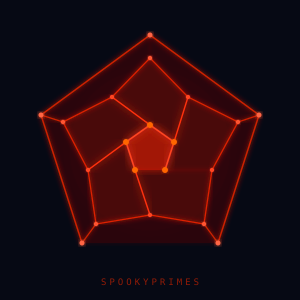

# SpookyPrimes

> This started as a funny idea. It collapsed into something smaller and more honest. That smaller thing is what this repository documents.

<p align="center">
  <a href="https://vsavytsk1.github.io/SpookyPrimes/">
    
  </a>
  <br/>
  <sub><i>20 vertices · 30 edges · 12 open questions · click to explore</i></sub>
</p>


---

## 👇 Open this first. Seriously.

### **[🔴 The Dodecahedron of Open Questions — Live Interactive](https://vsavytsk1.github.io/SpookyPrimes/)**

12 rotating pentagons. Each one is an open problem in physics.
**Click a red face. Read the question. Then come bac,k here.**

*Works on mobile — pinch to zoom, drag to rotate, tap to explore.*

---

**This work is dedicated to humanity.**

The core ideas and foundational frameworks are intended to remain open. No patents should be filed on the fundamental concepts.

---

## What is this actually about?

A machine-verified computational study of the algebraic structure of the Standard Model, working within Connes' noncommutative geometry framework.

The original hypothesis (a maximalist "Reality Generator" object) did not survive contact with the Choi–Effros–Størmer theorem and careful parameter counting. This repository documents what survived that failure — which turns out to be precise and checkable.

The short version: **we found a 16-dimensional plateau in the space of Dirac operators that maps exactly to the Yukawa parameter count of the Standard Model.** Three algebras tie at this dimension, which precisely locates an open problem nobody has closed yet.

**The surviving results:**
- An explicit, machine-verified unital ∗-embedding `A_F ↪ A_PS` (correcting an error in the original PDF)
- `dim D(A_F) = 16` — matching the Standard Model Yukawa parameter count per generation (SVD-verified)
- A subalgebra plateau: three algebras share this dimension, precisely locating the open problem
- The Pati-Salam → Standard Model carveout characterized as the breaking of a leptoquark Yukawa pairing
- Koide ratio K = 0.6666645(5) at PDG 2024, 0.43σ from 2/3, with full Monte Carlo uncertainty propagation

Every numerical claim has a corresponding script. Nothing is adjusted to fit.

---

## Licensing

- **Code**: MIT License

See the full [LICENSE](LICENSE) file for details.

---

## Run it yourself (5 minutes)

```bash
git clone https://github.com/vsavytsk1/SpookyPrimes.git
cd SpookyPrimes
pip install -r requirements.txt
python proposition/computational_receipts/phase5_structure.py
```

`phase5_structure.py` prints the core result: the 16-dimensional plateau and its mapping to the Yukawa parameter structure. Everything else is how we got there.

---

## Computational Phases

All scripts are in `proposition/computational_receipts/`.

| Script | What it does |
|---|---|
| `phase1_koide.py` | Koide ratio at PDG 2024 masses, Monte Carlo uncertainty propagation (2M samples) |
| `phase2a_explicit_embedding.py` | Explicit unital ∗-embedding A_F → Pati-Salam, 5 independent verification checks |
| `phase2a_v2.py` | Enumeration variant of the embedding construction |
| `phase2c_carveout.py` | Bimodule construction for the PS → SM reduction |
| `phase3_dirac_dim_v2.py` | Dirac operator space via null space of order-one constraints, N=32 Hilbert space |
| `phase4_fast.py` | Vectorized BLAS scan of the full subalgebra chain — the plateau appears here |
| `phase5_structure.py` | Subspace equality proofs, 16-dimensional Yukawa parametrization |
| `phase6_8dim.py` | Pati-Salam 8-dimensional Dirac space, leptoquark Yukawa pairing identification |

### Hilbert space convention

Basis states are indexed as `(a, s, w, c)` where:
- `a = ±1` — particle / antiparticle
- `s = ±1` — left / right chirality
- `w = ±1` — weak isospin
- `c = 1..4` — color (3 quark + 1 lepton)

Total: N = 32 states per generation.

---

## The Open Problem

Three algebras share dim D = 16:

| Algebra | Real dim | Dirac dim |
|---|---|---|
| C ⊕ M₃(C) | 21 | **16** |
| H ⊕ M₃(C) | 23 | **16** |
| A_F = C ⊕ H ⊕ M₃(C) | 25 | **16** |

The Standard Model algebra A_F is not uniquely selected by dim D alone. A variational functional F on finite real spectral triples (KO-dimension 6) that has A_F as its unique critical point — if one exists — must encode gauge content (unitary groups), not just dimension. Finding it, or proving it cannot exist, is the open problem.

---

## Papers (in `proposition/`)

| File | Description |
|---|---|
| `funny idea.pdf` | The original maximalist hypothesis — included for honesty, not correctness |
| `strangeIdea.pdf` | First stress-test: where the original hypothesis breaks |
| `core research/strange_idea_continued.pdf` | What survived — the actual results documented here |
| `CoreOntology_funny_coincidence.pdf` | Ontological framing |
| `RealityGeneratorInspiration.pdf` | The original inspiration, kept for context |
| `Evaluating a Theory of Everything.pdf` | Epistemological framework used throughout |

---

## Interactive

| Thing | What it is |
|---|---|
| **[🔴 Dodecahedron](https://vsavytsk1.github.io/SpookyPrimes/)** | 12 open problems in physics. Spin it. Click a pentagon. |
| **[graph.html](graph.html)** | Full research knowledge graph — every concept, every connection |
| **[video.html](video.html)** | Because why not |

> The dodecahedron works best as your entry point. Each of the 12 faces is a question this program either answered, failed to answer, or precisely located. The geometry is not decorative — a dodecahedron has 12 pentagonal faces, 20 vertices, 30 edges. 20 vertices = 20 named structural elements of the theory. Click them.

---

## Status

The computational work is complete and verified. The open problem is open. Feedback welcome.

(Twitt-X) @Sagaific

---

<details>
<summary><strong>Thank you</strong></summary>

<br>

OH TITANS OF THE “IF” SPACE — THANK YOU.

Thank you for refusing to stop asking why.

Thank you for spending your lives bending abstraction into something reality could not escape.

Thank you to the mathematicians who built structures so beautiful they seemed impossible to be useful — and then became the language of nature itself.

Thank you to the physicists who pushed reality until it finally revealed another layer beneath it.

Thank you to the engineers who transformed equations into bridges, reactors, circuits, aircraft, and civilizations.

Thank you to every teacher who kept the flame alive long enough for another generation to continue the search.

The work was not in vain.  
None of it was in vain.

Because the universe, in all its terrifying complexity, keeps whispering the same thing to us over and over again:

> Nature is immensely lazy,  
> profoundly efficient,  
> and entirely unconcerned with the mathematical difficulties we invent for ourselves.

And whatever insight brought us here was not created by one person.  
It emerged from thousands of years of collective human curiosity compressing itself across generations.

If our work means anything at all, I hope it reminds future generations of scientists of something simple:

**There is no shame in not understanding reality yet.**  
The shame is only in stopping the search.

So to the next generation:  
ask impossible questions,  
follow strange intuitions carefully,  
respect rigor more than ego,  
and never lose your capacity for wonder.

Because somewhere out there,  
hidden beneath all the noise,  
reality is still waiting for us to ask one more beautiful question.

**Thank you.**

</details>
